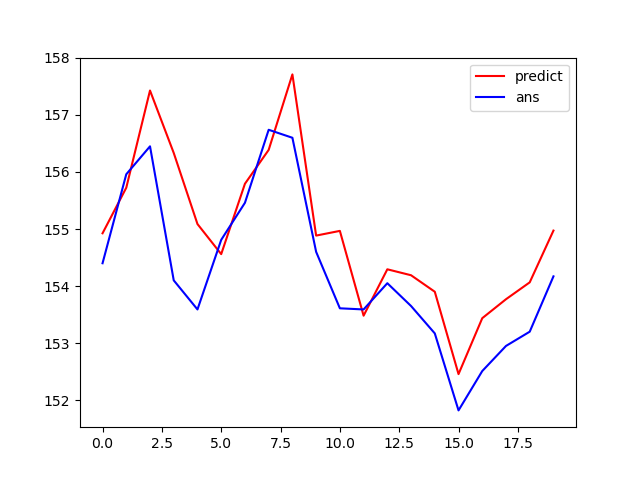

# DSAI-HW2-2022-AutoTrading

# Data
* NASDAQ:IBM stock prices data.
* csv data includes (open、high、low、close).
# Method
## Data preprocessing
we choose stock close price  to predict next day stock open price.
## Model
Because stock prices is time series data, we choose LSTM from tensflow to predict next day stock price.
## predict result

# Trader Strategy
* if the prediction of open price is more than last day open price, buy stock(1).
* if the prediction of open price is less than last day open price, sell stock(-1).
* if holds stock and predicts price increase in next day, do nothing(0).
* if not holds stock and predicts price decrease in next day, do nothing(0).
# Execution
python 3.7.0
```
python app.py
```